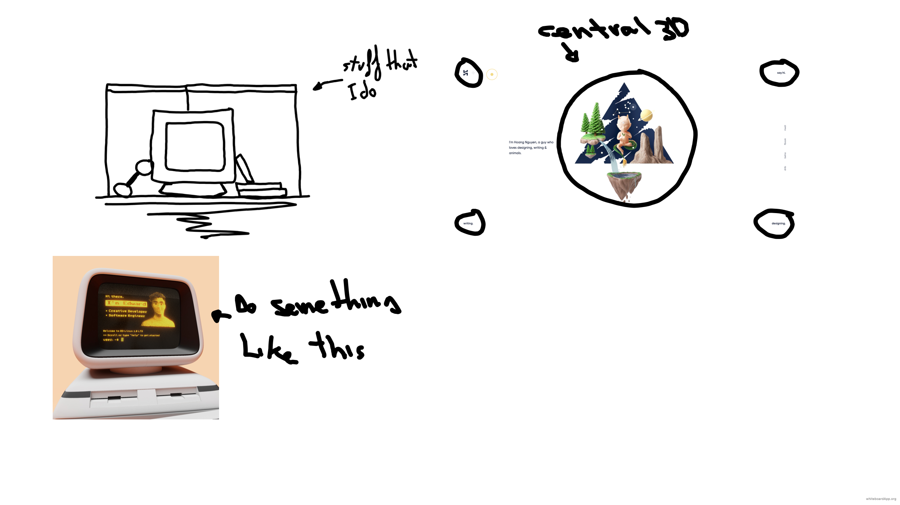
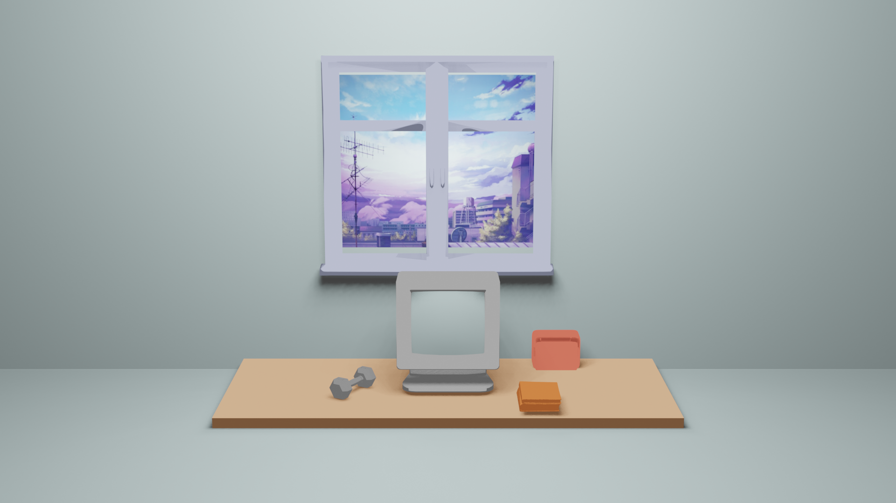

    <h1>Welcome</h2>
    <h2>I'm Ayoub Khalfaoui Hadi</h4>
    
I am a self-taught student with a goal of becoming a software engineer. My strong interest in computer science drives me to constantly improve my skills and knowledge through self-study and staying up-to-date on the latest technologies and programming languages. I am highly motivated and dedicated to achieving success in this field.

    

    Thank you for taking the time to review my portfolio. If you have any questions or would like to connect, you can reach me at <a href='mailto: eyub.kh@gmail.com'>eyub.kh@gmail.com</a>.

    <h1 >About Me</h2>
    
I am living in the United Kingdom, but I was born in Spain and have family from Morocco , so I have a diverse cultural background. I've always felt that I don't really belong to any one specific place, and that's why I love traveling and learning about other cultures.

    
I also enjoy staying active and do sport at the gym regularly. I find it not only keeps me physically fit, but it also helps me to clear my mind and reduce stress. In my free time, I also love being outside and spending time in nature.

# Portfolio

Must to express my character and my pasions, also must to have balance between 3D and javascript.

Expression:
  - Self-taught
  - Sport guy
  - Books

Site map:
  - Home
  - Skills
  - Projects
  - Contact

